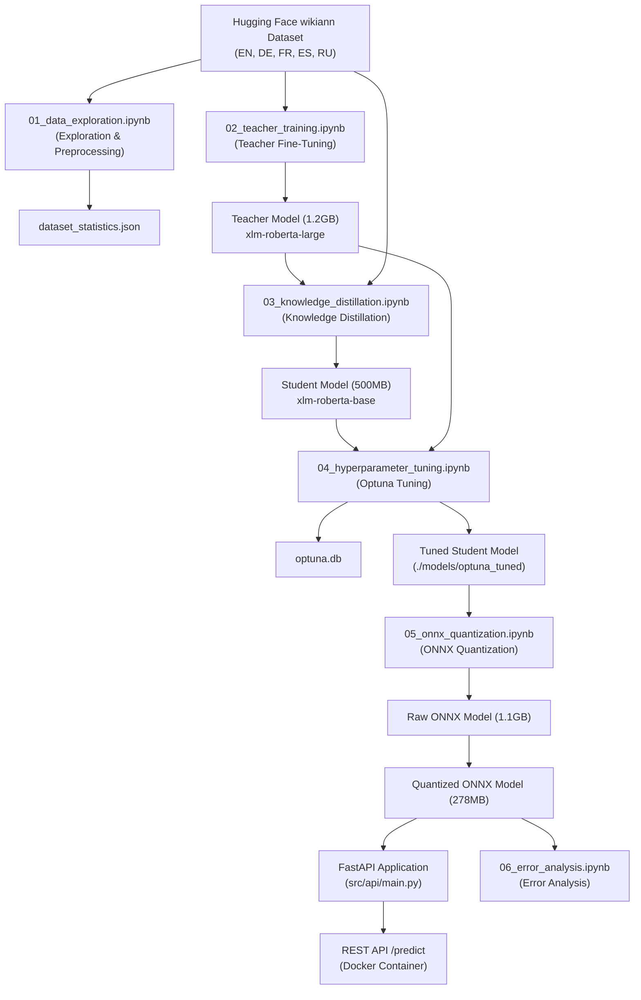
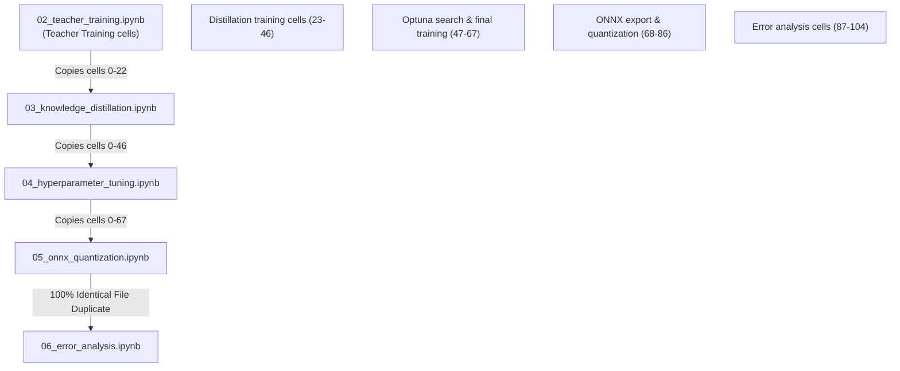
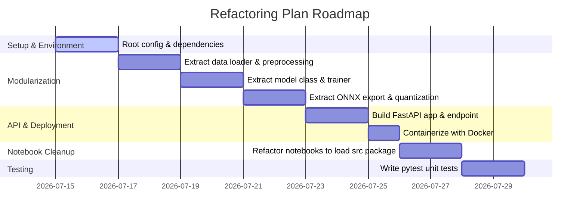

# Project Audit: Multilingual NER Pipeline with Production Optimization

## Executive Summary

This repository is styled as an *"industrial-grade pipeline for multilingual Named Entity Recognition (NER) featuring state-of-the-art optimization techniques for production deployment."* However, an exhaustive inspection reveals a significant gap between the claims in the documentation (`README.md`) and the actual implementation in the repository:

1. **Complete Absence of Production Code**: The `src/` directory—intended to contain the production FastAPI application, training code, and optimization scripts—consists entirely of empty subdirectories.
2. **Missing Infrastructure & Dependency Files**: Essential files described in the README, such as the root `requirements.txt`, `Dockerfile`, `docker-compose.yml`, and tests, are completely missing.
3. **Cumulative and Duplicate Notebooks**: The notebooks (`notebooks/`) are highly redundant and cumulative. Notebooks 02 through 05 build upon each other by copy-pasting previous code cells. Crucially, `06_error_analysis.ipynb` is a **100% identical byte-for-byte duplicate** of `05_onnx_quantization.ipynb`.
4. **Hardcoded Environment Assumptions**: The notebooks were developed on Kaggle and contain hardcoded paths (`/kaggle/working/`), platform-specific commands (such as cleaning disk space via shell commands), and custom plotly renderers designed specifically for Kaggle.
5. **Flawed Benchmarking Baseline**: In the ONNX optimization benchmark, PyTorch is evaluated on GPU (taking ~8ms) while ONNX is evaluated on CPU (using the CPU execution provider). This mismatch is acknowledged in a markdown note: *"pytorch -> cheated -> used GPU and ran in 8 ms, while ONXX used CPU"*.
6. **Pre-computed Results Ignored**: While the codebase is incomplete, the ignored output folder `ner-project-results/` contains valuable serialized models, checkpoints, Optuna databases, and HTML visualization reports from previous Kaggle runs.

This audit provides a detailed diagnostic of the codebase's current state and outlines a prioritized refactoring plan to convert this research dump into the production-ready MLOps pipeline advertised.

---

## Repository Health Score: **35 / 100**

While the underlying ML engineering ideas (knowledge distillation, Optuna hyperparameter optimization, and dynamic quantization) are robust and the pre-computed artifacts under `ner-project-results` demonstrate successful training, the repository suffers from massive structural issues, missing production components, and duplicate code:

- **Modularization & Clean Code (05/20)**: `src/` is completely empty. No python modules exist.
- **Reproducibility & Environment (08/20)**: Hardcoded `/kaggle/` paths, missing root dependencies, and missing docker infrastructure.
- **Testing & Quality Assurance (00/20)**: No test suite or tests directory contents exist.
- **Notebook & Research Quality (12/20)**: High redundancy; `06_error_analysis.ipynb` is a duplicate file.
- **Documentation & Packaging (10/20)**: Good README structure, but describes files and APIs that do not actually exist in the codebase.

---

## Major Issues

### 1. Empty Source Code Directories
The `src/` directory contains folders for `api`, `data`, `models`, `optimization`, and `training`, but **not a single Python file** is present. The modularized software engineering architecture promised in the README is completely absent.

### 2. Missing Core Files
The following files are missing in the repository, despite being referenced in the README:
- `requirements.txt` (only a minimal deployment requirements file exists inside the results folder)
- `Dockerfile`
- `docker-compose.yml`
- `CONTRIBUTING.md`
- `docs/images/optimization_comparison.png`

### 3. Duplicate and Cumulative Notebooks
- **Notebook 06 is a Duplicate**: `05_onnx_quantization.ipynb` and `06_error_analysis.ipynb` are byte-for-byte identical (MD5: `6de13d93ddebc3c284fd7f829074f5a0`).
- **Cumulative Cell Copy-Pasting**:
  - `03_knowledge_distillation.ipynb` copy-pastes cells 0 to 19 of `02_teacher_training.ipynb`.
  - `04_hyperparameter_tuning.ipynb` copy-pastes all distillation cells of `03_knowledge_distillation.ipynb`.
  - `05_onnx_quantization.ipynb` copy-pastes all Optuna cells of `04_hyperparameter_tuning.ipynb` and appends both ONNX quantization and Error Analysis at the end.
  This leads to massive notebooks (>800 KB) that are extremely slow to load and difficult to run or debug.

### 4. Hardcoded Environment Assumptions
The notebooks assume a Kaggle Environment and include:
- Hardcoded output paths: `/kaggle/working/models/teacher`
- Disk management commands: `!rm -rf /kaggle/working/models/student_distilled/checkpoint-2500`
- Archive creation: `!tar -cvJf /kaggle/working/teacher_model_training_compressed.tar.xz -C /kaggle/working .`
- W&B API and Plotly environment overrides: `pio.renderers.default = "notebook_connected"`

### 5. Flawed PyTorch vs. ONNX Benchmarking
The benchmarking class `ModelBenchmark` evaluates PyTorch on GPU (if available) but forces ONNX to use `CPUExecutionProvider`. This results in an unfair latency comparison and misleading metrics.

### 6. Empty API Implementation
The script `ner-project-results/models/optimized/deployment/inference_example.py` is a skeleton with a dummy `predict` method that has a `pass` statement. No actual FastAPI code is implemented anywhere in the repository.

---

## Minor Issues

- **Empty Config Directory**: The `configs/` directory is empty. All configuration parameters are hardcoded inside configuration classes inside each notebook (e.g. `TeacherConfig`, `DistillationConfig`, `ErrorAnalysisConfig`).
- **Empty Tests Directory**: The `tests/` directory is empty. There are no test scripts for testing code formatting, type checking, or model execution.
- **W&B and Optuna State Leakage**: Training runs directly interface with Weights & Biases and Optuna databases without verifying if the API tokens are set or if the database is locked.
- **Plotly Dependency Warnings**: The notebooks contain dependencies on packages like `kaleido` and `plotly` that may have compatibility issues on local platforms.

---

## Missing Components

1. **FastAPI Application**:
   - Web application structure in `src/api/`.
   - Single prediction route (`/predict`).
   - Batch prediction route (`/batch_predict`).
   - Health check endpoint (`/health`).
   - Supported languages endpoint (`/languages`).
2. **Docker Orchestration**:
   - `Dockerfile` containerizing the FastAPI app and loading the quantized ONNX model.
   - `docker-compose.yml` for multi-service setup.
3. **Data Loading Module**:
   - Modularized dataset loading, alignment, and tokenization in `src/data/`.
4. **Model Abstraction**:
   - Modularized class for raw PyTorch models and ONNX/Quantized models in `src/models/`.
5. **Training/Distillation Pipelines**:
   - Command-line interface (CLI) or script-based training loops in `src/training/`.
6. **Optimizations Pipeline**:
   - Modularized script for ONNX conversion and Quantization under `src/optimization/`.
7. **Test Suite**:
   - Unit tests under `tests/` utilizing `pytest`.

---

## Recommended Folder Structure

Below is the proposed layout to organize the modular codebase, separating research notebook workflows from production code:

```bash
multilingual-ner-pipeline-with-production-optimization/
├── configs/                            # Configuration management
│   ├── teacher_config.yaml             # Config for teacher training
│   ├── distillation_config.yaml        # Config for student distillation
│   ├── tuning_config.yaml              # Config for Optuna tuning
│   └── optimization_config.yaml        # Config for ONNX and quantization
├── notebooks/                          # Walkthrough notebooks (cleaned)
│   ├── 01_data_exploration.ipynb      # Exploration step
│   ├── 02_teacher_training.ipynb      # Loads training from src.training
│   ├── 03_knowledge_distillation.ipynb # Loads distillation from src.training
│   ├── 04_hyperparameter_tuning.ipynb  # Loads tuning from src.optimization
│   ├── 05_onnx_quantization.ipynb     # Loads ONNX export from src.optimization
│   └── 06_error_analysis.ipynb        # Performs error analysis (unique code)
├── src/                                # Production package source
│   ├── __init__.py
│   ├── api/                            # FastAPI app
│   │   ├── __init__.py
│   │   ├── main.py                    # Main app configuration
│   │   └── routes.py                  # API endpoints (/predict, /health)
│   ├── data/                           # Data loading and processing
│   │   ├── __init__.py
│   │   └── dataset.py                 # WikiANN downloader and token-alignment
│   ├── models/                         # Model loader definitions
│   │   ├── __init__.py
│   │   └── inference.py               # ONNX & PyTorch NER wrappers
│   ├── training/                       # Training execution logic
│   │   ├── __init__.py
│   │   ├── teacher.py                 # Teacher training runner
│   │   └── distillation.py            # Distillation trainer and loss
│   └── optimization/                   # Export and compression
│       ├── __init__.py
│       ├── onnx_export.py             # PyTorch -> ONNX
│       └── quantization.py            # ONNX -> Quantized ONNX
├── tests/                              # PyTest test suite
│   ├── __init__.py
│   ├── test_api.py                    # API route tests
│   ├── test_data.py                   # Token alignment tests
│   └── test_optimization.py           # ONNX model inference tests
├── Dockerfile                          # Deployment container configuration
├── docker-compose.yml                  # Service orchestration
├── requirements.txt                    # Project development dependencies
└── PROJECT_AUDIT.md                    # This document
```

---

## Notebook Inputs and Outputs

The table below outlines the inputs, outputs, and purposes of each notebook in the repository:

| Notebook | Title | Input | Output | Purpose |
| :--- | :--- | :--- | :--- | :--- |
| `01_data_exploration.ipynb` | Data Exploration | Hugging Face `wikiann` dataset | `sentence_length_analysis.png`, `language_comparison.png`, `dataset_statistics.json` | Explores text lengths, language token counts, label balance, and designs preprocessing. |
| `02_teacher_training.ipynb` | Teacher Training | `wikiann` dataset, `xlm-roberta-large` base weights | Trained teacher model checkpoint (saved under `./models/teacher`), `training_plots.png`, `training_metrics.json` | Fine-tunes XLM-RoBERTa-large on multilingual subsets (EN, DE, FR). |
| `03_knowledge_distillation.ipynb` | Knowledge Distillation | Trained teacher model checkpoint, `xlm-roberta-base` base weights | Trained student model (`./models/student_distilled`), `distillation_plots.png`, `comparison_results.json` | Performs KL divergence distillation from teacher to student. |
| `04_hyperparameter_tuning.ipynb` | Hyperparameter Tuning | Trained teacher model, student base model | Optuna SQL database (`optuna.db`), interactive charts, tuned student model (`./models/optuna_tuned`) | Optimizes student distillation hyperparameters using Optuna. |
| `05_onnx_quantization.ipynb` | ONNX Quantization | Tuned student model checkpoint | `model.onnx`, `model_quantized.onnx`, `optimization_results.json`, benchmarking comparison figures | Exports student to ONNX, quantizes to INT8, and runs speed/memory benchmarks. |
| `06_error_analysis.ipynb` | Error Analysis | Tuned/Quantized model, multilingual test data | Error report logs, confusion matrices, and error distribution analyses | Duplicated file containing the cells of Notebook 05. It should isolate language/boundary error analysis. |

---

## Graphs

### 1. Overall Pipeline Execution Graph
This diagram shows the end-to-end data and training flow from the raw dataset down to the deployed FastAPI API:



### 2. Notebook Dependency Graph (Current Cumulative Structure)
This diagram illustrates how the notebooks are currently nested, showing code replication and structural dependencies:



---

## Technical Debt

1. **Cell Replication**: Because notebooks copy previous cells, any bug fixed in an earlier stage (like data cleaning in Notebook 02) must be manually updated in Notebooks 03, 04, 05, and 06.
2. **Kaggle Sandbox vs. Local Execution**: The dependency on the Kaggle directory structure (`/kaggle/working`) prevents immediate local code execution.
3. **Implicit Imports**: Notebooks often import the same package multiple times in different cells or run shell commands (`!pip install`) that disrupt local dependency management.
4. **Lack of Model abstractions**: The prediction code in the notebooks manually performs tokenizer processing and logits calculations. There is no consolidated model wrapper class.
5. **No Parameter Configuration**: All model settings, learning rates, epochs, and language selections are defined inside the notebook cells rather than externally in configs.

---

## Risks & Unknowns

- **Model Loading in Quantization**: The quantization notebook tries to load PyTorch checkpoints first and falls back to ONNX on error. If both fail due to missing local weights, the notebook crashes.
- **Hardware Discrepancies**: Benchmarking numbers in the README (~25ms for Quantized ONNX) were obtained on Kaggle CPU/GPU nodes. Running locally on standard hardware will show different latencies.
- **W&B Authentication**: The training code tries to initialize Weights & Biases. Running the scripts locally without setting the W&B API key environment variable will cause execution blocks.
- **Plotly Kaleido Failures**: Converting Plotly figures to static PNGs inside the notebooks requires a working installation of `kaleido`, which frequently errors on certain operating systems (especially Windows/ARM).

---

## Suggested Refactoring Plan

The following refactoring roadmap converts the existing research notebooks into a clean, reproducible, and deployable production application:



---

## Prioritized TODO List

### Phase 1: Environment and Setup (High Priority)
- [ ] Create a root `requirements.txt` containing all development and production dependencies.
- [ ] Create a centralized configuration folder `configs/` and define parameters for teacher, student, and ONNX models.
- [ ] Implement a helper module to abstract away platform paths (e.g. handle `/kaggle/working` vs local `./` automatically using environment variables).

### Phase 2: Code Extraction and Modularization (High Priority)
- [ ] Move tokenization and aligned labeling code into `src/data/dataset.py`.
- [ ] Move training and distillation logic (including `DistillationTrainer`) into `src/training/distillation.py`.
- [ ] Move ONNX conversion, optimization, and quantization routines into `src/optimization/quantization.py`.
- [ ] Create a unified `MultilingualNER` inference wrapper class in `src/models/inference.py` to handle both PyTorch and ONNX predictions.

### Phase 3: FastAPI Web Service & Containerization (Medium Priority)
- [ ] Implement the FastAPI service (`src/api/main.py` and `routes.py`) featuring single predictions (`/predict`), batch predictions (`/batch_predict`), health check (`/health`), and metrics tracking.
- [ ] Implement a fully functional `inference_example.py` inside the deployment artifacts.
- [ ] Write a root `Dockerfile` to containerize the FastAPI web application.
- [ ] Write a `docker-compose.yml` to launch the API container.

### Phase 4: Notebook Cleanup & Deduplication (Medium Priority)
- [ ] Remove duplicate cells from notebooks. Refactor the notebooks to import modular code from `src/` instead of redefining functions in every notebook.
- [ ] Resolve the duplicate notebook issue: delete or rename `06_error_analysis.ipynb` and ensure it only performs the final evaluation analysis without training/quantization overhead.
- [ ] Correct the benchmarking logic in Notebook 05 so both PyTorch and ONNX baseline benchmarks run under the same execution provider (CPU vs CPU) for a fair comparison.

### Phase 5: Testing & QA (Low Priority)
- [ ] Write tests under `tests/test_data.py` to verify label alignment logic.
- [ ] Write tests under `tests/test_optimization.py` to verify ONNX model output shapes.
- [ ] Write tests under `tests/test_api.py` to verify API endpoint responses and status codes.
