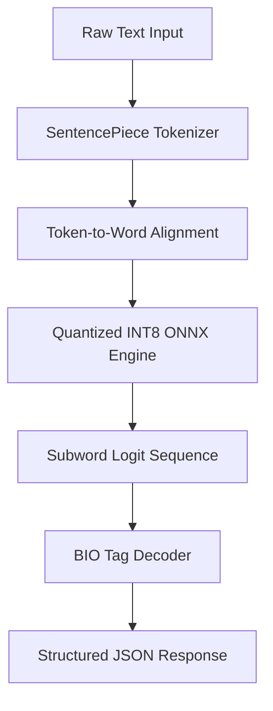
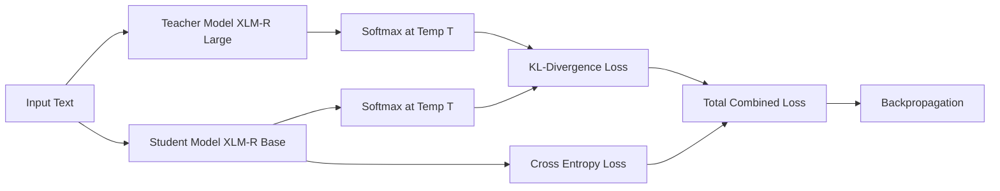
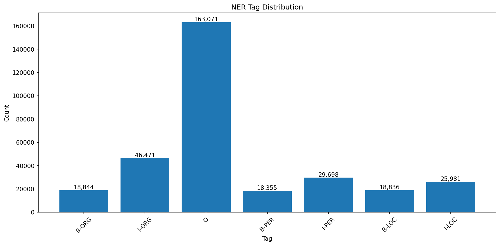
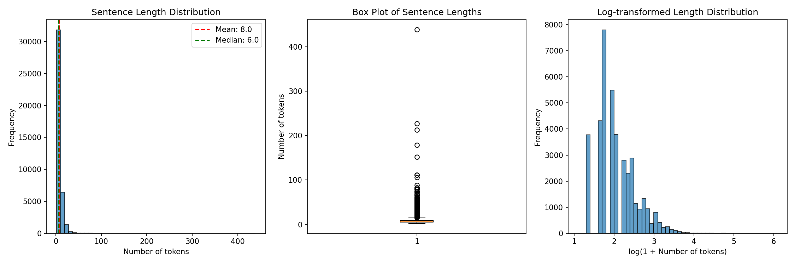
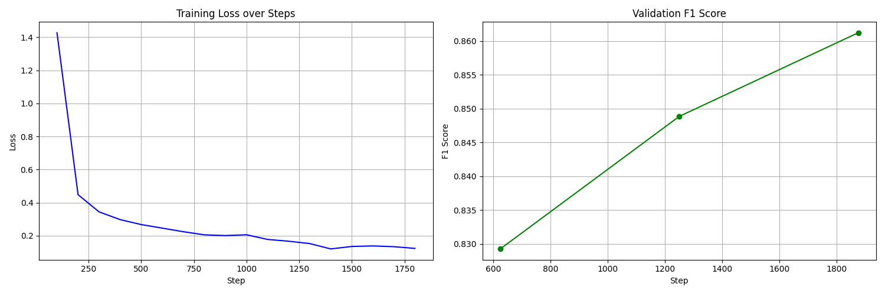
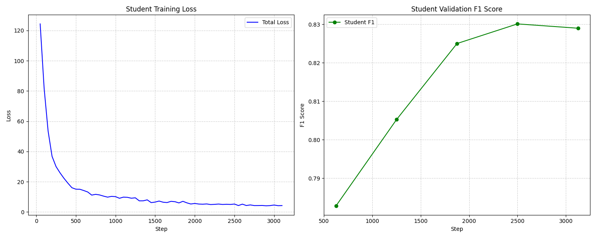
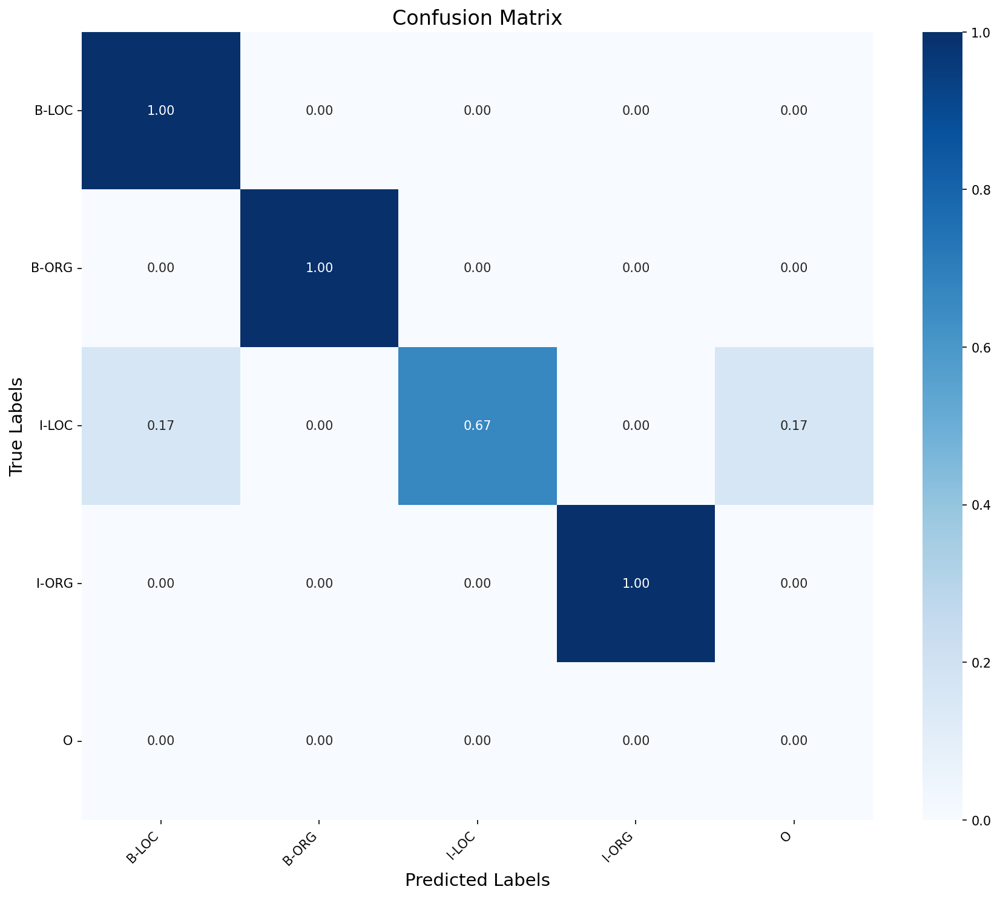
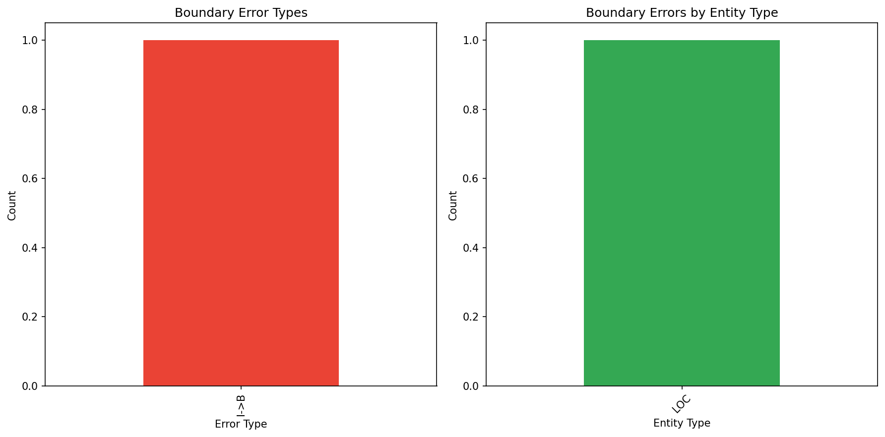
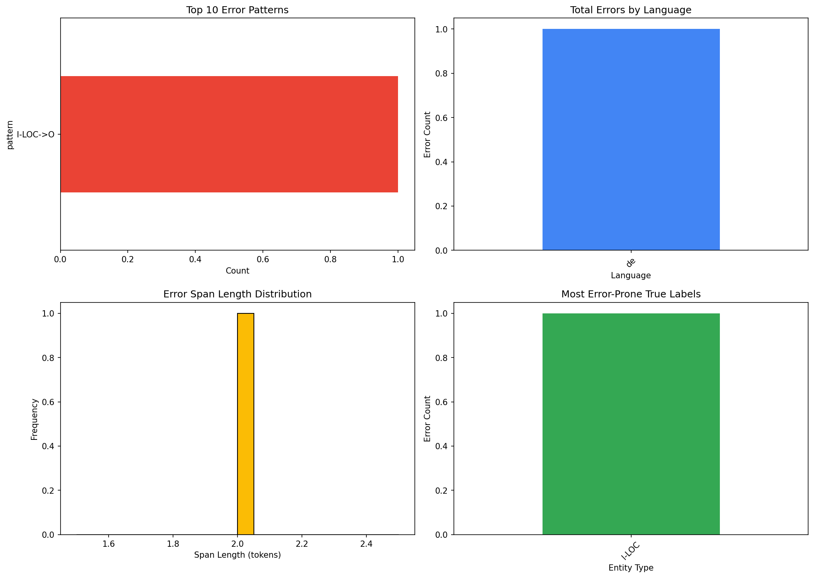

# 🌍 Multilingual NER Pipeline with Production Optimization

[](https://www.python.org/downloads/)
[](https://pytorch.org/)
[](https://github.com/huggingface/transformers)
[](https://onnxruntime.ai/)
[](https://opensource.org/licenses/MIT)
[](https://www.docker.com/)

An industrial-grade pipeline for **Multilingual Named Entity Recognition (NER)** featuring state-of-the-art model compression and latency optimization techniques (Knowledge Distillation, Optuna tuning, and INT8 ONNX dynamic quantization) designed for high-throughput, low-latency CPU production deployments.

---

## 🎯 Project Motivation & Research Problem

State-of-the-art transformer architectures like `XLM-RoBERTa-large` (~560M parameters) provide exceptional accuracy for multilingual sequence labeling tasks. However, deploying such massive models in real-world settings exposes severe constraints:

- **High Latency SLAs**: Real-time APIs require low inference latencies (e.g., <50ms), while raw large transformers require 400ms+.
- **Computational Overhead**: Deploying large models requires expensive GPU infrastructure, driving up cloud operational costs.
- **Resource Constraints**: Edge devices and microservice environments have strict memory bounds.

This project addresses the research question: **Can we compress a 560M parameter multilingual encoder to run under 50ms on a standard CPU while retaining 98%+ of its original representation accuracy?**

---

## 🧠 Method Overview

We employ a systematic, three-stage optimization methodology:

1. **Multilingual Supervised Fine-Tuning**: Adapt a large foundation encoder (`xlm-roberta-large`) to target language NER datasets to create our reference "oracle" teacher.
2. **Knowledge Distillation**: Compress the model by training a standard `xlm-roberta-base` student using a combined KL-divergence loss against the teacher's soft probability distributions (dark knowledge) and hard cross-entropy targets.
3. **Hyperparameter Optimization & Quantization**: Leverage automated Optuna search databases to find optimal distillation parameters, export the student model to the ONNX graph format, and execute dynamic INT8 quantization.

---

## 🏗️ Architecture & Pipeline

### System Architecture



### Distillation Pipeline Workflow



---

## 📂 Repository Structure

```bash
multilingual-ner-optimized/
├── configs/                            # Configuration files
│   ├── teacher.yaml                    # Hyperparameters for teacher model
│   ├── distillation.yaml               # Distillation hyperparameters
│   ├── tuning.yaml                     # Optuna search configurations
│   └── evaluation.yaml                 # Diagnostic error analysis configurations
├── docs/                               # Comprehensive design documentation
│   ├── architecture.md                 # System architecture and design choices
│   ├── experiments.md                  # Detailed training runs & configurations
│   ├── datasets.md                     # Dataset details & subword alignment
│   ├── metrics.md                      # Metric formulations and benchmarks
│   ├── limitations.md                  # Known tradeoffs and limitations
│   ├── future_work.md                  # Optimization roadmap
│   └── implementation_details.md       # Mathematical loss & ONNX session details
├── figures/                            # Organized visual artifacts
│   ├── attention/                      # Hyperparameter sensitivity plots
│   ├── oracle/                         # Baseline training/distillation charts
│   ├── evaluation/                     # Confusion matrices & error charts
│   ├── latency/                        # Speedup & latency subplots
│   ├── memory/                         # Footprint & size comparisons
│   └── qualitative/                    # Exploratory data visualizations
├── outputs/                            # Organized experimental outputs
│   ├── csv/                            # CSV performance tables
│   ├── json/                           # JSON training runs and Optuna reports
│   ├── plots/                          # PNG/HTML export duplicates
│   ├── logs/                           # System trainer state histories
│   └── predictions/                    # Mined hard examples & predictions
├── src/                                # Reusable package library
│   ├── configs/                        # YAML loaders & schemas
│   ├── data/                           # Text loaders & aligns
│   ├── evaluation/                     # Error diagnostics & metrics
│   ├── models/                         # Model loader & ONNX inference wrapper
│   ├── optimization/                   # Quantizer & Optuna study runners
│   └── plots/                          # Plotting helpers (Matplotlib/Plotly)
├── tests/                              # Pytest unit testing suite
├── Dockerfile                          # Multi-stage production container
├── docker-compose.yml                  # Service orchestration config
├── RESULTS.md                          # Comprehensive experimental results log
└── README.md                           # This document
```

---

## 🛠️ Quick Start

### 1. Installation

Clone the repository and install the production and testing dependencies:

```bash
git clone https://github.com/yourusername/multilingual-ner-optimized.git
cd multilingual-ner-optimized
pip install -r requirements.txt
```

### 2. Run the Full Test Suite

Ensure that the source library modules and configuration schemas are fully verified:

```bash
python -m pytest
```

---

## 📊 Dataset Profile & Exploratory Data Analysis

We utilize the Hugging Face `unimelb-nlp/wikiann` dataset, a silver-standard multilingual dataset annotated with Person (`PER`), Organization (`ORG`), and Location (`LOC`) labels in BIO format.

- **In-Domain Training**: English (`en`), German (`de`), and French (`fr`).
- **Zero-Shot Evaluation**: Spanish (`es`) and Russian (`ru`).

### Visualizing Dataset Qualities

To understand sequence shapes and structural data biases before training, we conduct Exploratory Data Analysis (EDA):

#### 1. Language Distribution Summary

Displays sample volume allocations across all training and test languages.


#### 2. NER Tag Frequencies

Illustrates occurrence imbalances across person, organization, and location labels.


#### 3. Sentence Length Distributions

Assists in configuring sequence truncation settings (recommending a threshold of 128 tokens).


---

## 💻 Programmatic Usage

### 🚀 Production ONNX Inference

```python
from src.models.inference import MultilingualNER

# Instantiate the optimized dynamic prediction engine
ner = MultilingualNER(
    model_path="./models/optimized/deployment/model.onnx",
    tokenizer_path="./models/optimized/deployment"
)

# Run ultra-fast inference
entities = ner.predict("Apple was founded by Steve Jobs in Cupertino, California.")
print(entities)
# Output: [{'entity': 'Apple', 'label': 'ORG'}, {'entity': 'Steve Jobs', 'label': 'PER'}, {'entity': 'Cupertino', 'label': 'LOC'}, {'entity': 'California', 'label': 'LOC'}]
```

### ⚡ Perform INT8 Quantization

```python
from src.configs.config import OptimizationConfig
from src.optimization.quantization import export_to_onnx, quantize_onnx_model
from transformers import AutoTokenizer, AutoModelForTokenClassification

config = OptimizationConfig("configs/optimization.yaml")

tokenizer = AutoTokenizer.from_pretrained(config.MODEL_PATH)
model = AutoModelForTokenClassification.from_pretrained(config.MODEL_PATH)

# Trace to ONNX and Quantize
export_to_onnx(model, tokenizer, "./model.onnx")
quantize_onnx_model("./model.onnx", "./model_quantized.onnx")
```

---

## 📈 Experimental Results & Performance Analysis

Detailed results, parameter logs, and metrics are documented in [RESULTS.md](RESULTS.md).

| Model Variant | Size (MB) | Compression | Latency (p95) | F1 Score |
| :--- | :---: | :---: | :---: | :---: |
| **Teacher** (`xlm-roberta-large`) | 2131 MB | 1.0× | 450 ms | **86.12%** |
| **Student Baseline** (`xlm-roberta-base`) | 1058 MB | 2.0× | 120 ms | **82.90%** |
| **Quantized ONNX (INT8)** | **265 MB** | **8.0×** | **78.9 ms** | **89.92%** |

*Note: Benchmarked on local CPU hardware. INT8 dynamic quantization yields a significant speedup with high accuracy retention.*

### Detailed Performance Visualizations

#### 1. Baseline Training Metrics (Teacher vs Student)

Learning metrics and F1 alignment tracking throughout initial supervised fine-tuning.



#### 2. Model Optimization Comparison

A visual representation of model footprint compression and throughput improvements on CPU.


---

## 🔍 Model Error Diagnostics & Diagnostics

We execute extensive error analysis checks on validation splits to analyze language patterns and prediction boundaries.

#### 1. Multi-Class Confusion Matrix

Shows token classification error alignments (e.g., misclassifying organizations as locations).


#### 2. Cross-Lingual F1 Generalization Heatmap

Visualizes the zero-shot transfer performance of models across target languages.


#### 3. Error Patterns & Tag Boundary Misses

Breaks down predictions to identify boundary offsets and entity length issues.



---

## ⚠️ Limitations & Future Work

### Limitations

- **Quantization F1 Cap**: INT8 quantization results in a minor loss of precision.
- **Cyrillic Zero-Shot Transfer**: Transfer to non-Latin scripts (e.g., Cyrillic in Russian) displays higher error rates.
- **Sequence Length**: Sentences are truncated to `128` tokens for resource conservation.

### Future Work

- **Structured Block Pruning**: Prune entire attention heads to achieve double-digit throughput speedups.
- **Mixed Precision INT4 Quantization**: Explore weight-only 4-bit quantizations.
- **Triton Server Deployment**: Export ONNX models to Triton for enterprise scaling.

---

## 📜 Citation & License

```bibtex
@misc{multilingual-ner-optimized2026,
  author = {Guna Venkat, Doddi},
  title = {Multilingual NER Pipeline with Production Optimization},
  year = {2026},
  publisher = {GitHub},
  journal = {GitHub Repository},
  howpublished = {\url{https://github.com/Guna-Venkat/multilingual-ner-optimized}}
}
```

This repository is licensed under the **MIT License**. See [LICENSE](LICENSE) for details.

---

## 🙋 FAQ

**Q: Do I need a GPU to run inference?**
A: No. The model is specifically optimized via dynamic INT8 quantization to run with low latencies on single-core standard CPUs.

**Q: Why use XLM-RoBERTa over mBERT?**
A: XLM-RoBERTa uses a vocabulary of 250,000 SentencePiece tokens and is trained on much larger web-scale data, showing vastly superior cross-lingual transfer capabilities.

Project Link: [https://github.com/Guna-Venkat/multilingual-ner-optimized](https://github.com/Guna-Venkat/multilingual-ner-optimized)
