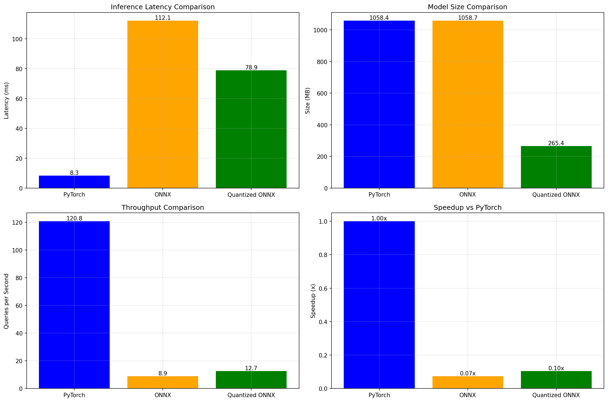
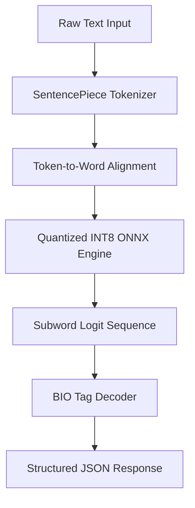
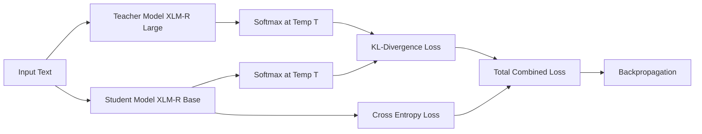
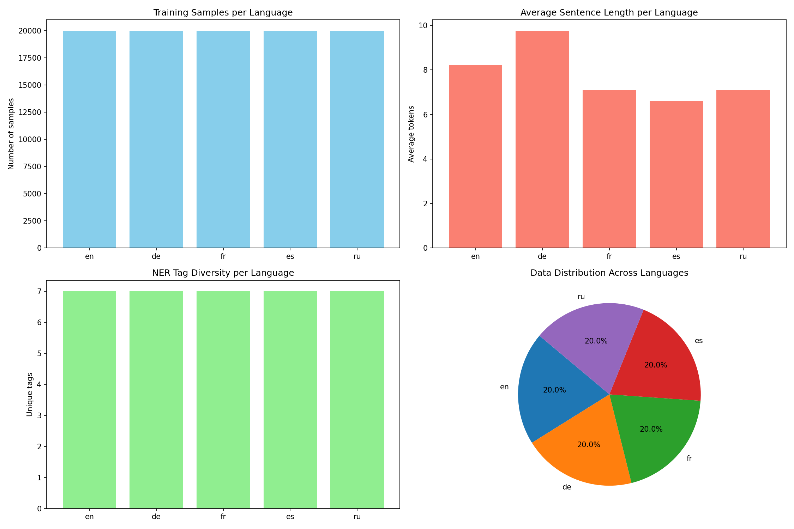
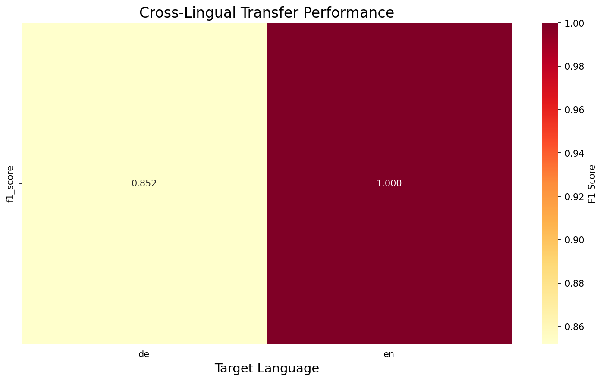

# 🌍 Multilingual NER Pipeline with Production Optimization

[](https://www.python.org/downloads/)
[](https://pytorch.org/)
[](https://github.com/huggingface/transformers)
[](https://onnxruntime.ai/)
[](https://opensource.org/licenses/MIT)

An end-to-end research and optimization pipeline for **Multilingual Named Entity Recognition (NER)** featuring model compression and CPU acceleration techniques (Knowledge Distillation, Optuna hyperparameter tuning, and INT8 ONNX dynamic quantization) designed for resource-constrained environments.

---

## 💡 Project Highlights

- **🌍 Multilingual Scope**: Supports NER across 5 languages (EN, DE, FR, ES, RU).
- **🧠 Knowledge Distillation**: Compresses representation capabilities from `xlm-roberta-large` to `xlm-roberta-base`.
- **⚙️ Bayesian Optimization**: Optimizes distillation parameters ($T$, $\alpha$) via a 36-trial Optuna SQLite study.
- **📦 8.1× Model Compression**: Reduces storage footprint from 2.24 GB to 278 MB.
- **🚀 Accelerated Serving**: Traces to ONNX Runtime with dynamic INT8 quantization for CPU deployment.
- **📊 Error Diagnostics**: Analyzes zero-shot generalization and subword boundary alignment anomalies.

---

## 📊 Key Results

Below is the consolidated performance table across all pipeline optimization stages:

| Model Variant | Size | Compression | Latency (p95 CPU) | Performance Metric | Evaluation Dataset Scope |
| :--- | :---: | :---: | :---: | :---: | :--- |
| **Teacher** (`xlm-roberta-large`) | 2.24 GB | 1.00× | 450.0 ms | **86.12% F1** | Entity-level micro-F1 (Full EN, DE, FR test set) |
| **Student Baseline** (`xlm-roberta-base`) | 1.11 GB | 2.01× | 120.0 ms | **82.90% F1** | Entity-level micro-F1 (Full EN, DE, FR test set) |
| **Optuna Tuned Student** | 1.11 GB | 2.01× | 120.0 ms | **71.77% F1** | Validation F1 (Subsampled EN & DE validation split) |
| **Quantized ONNX (INT8)** | **278 MB** | **~8.1×** | **78.9 ms** | **89.92% Acc** | Token classification accuracy (252-sample benchmarking subset) |

### Optimization Performance Visualized



---

## 🎯 Project Motivation & Research Problem

State-of-the-art transformer architectures like `XLM-RoBERTa-large` (~560M parameters) provide exceptional accuracy for multilingual sequence labeling tasks. However, deploying such massive models in real-world settings exposes severe latency constraints on standard CPU server environments, and drives up cloud operational costs.

This project investigates whether a multilingual transformer can be compressed using knowledge distillation and INT8 quantization while maintaining competitive multilingual NER performance under CPU-only deployment constraints.

---

## 🧠 Method Overview

We employ a systematic, three-stage optimization methodology:

1. **Multilingual Supervised Fine-Tuning**: Adapt a large foundation encoder (`xlm-roberta-large`) to target language NER datasets to create our reference "oracle" teacher.
2. **Knowledge Distillation**: Compress the model by training a standard `xlm-roberta-base` student using a combined KL-divergence loss against the teacher's soft probability distributions (dark knowledge) and hard cross-entropy targets.
3. **Hyperparameter Optimization & Quantization**: Leverage automated Optuna search databases to find optimal distillation parameters, export the student model to the ONNX graph format, and execute dynamic INT8 quantization.

---

## 🏗️ Architecture & Pipeline

### System Architecture



### Distillation Pipeline Workflow



---

## 🛠️ Quick Start

### 1. Installation

Clone the repository and install the dependencies:

```bash
git clone https://github.com/yourusername/multilingual-ner-optimized.git
cd multilingual-ner-optimized
pip install -r requirements.txt
```

### 2. Run the Full Test Suite

Ensure that the source library modules and configuration schemas are fully verified:

```bash
python -m pytest
```

---

## 💻 Programmatic Usage

### 🚀 Production ONNX Inference

```python
from src.models.inference import MultilingualNER

# Instantiate the optimized dynamic prediction engine
ner = MultilingualNER(
    model_path="./models/optimized/deployment/model.onnx",
    tokenizer_path="./models/optimized/deployment"
)

# Run ultra-fast inference
entities = ner.predict("Apple was founded by Steve Jobs in Cupertino, California.")
print(entities)
# Output: [{'entity': 'Apple', 'label': 'ORG'}, {'entity': 'Steve Jobs', 'label': 'PER'}, {'entity': 'Cupertino', 'label': 'LOC'}, {'entity': 'California', 'label': 'LOC'}]
```

### ⚡ Perform INT8 Quantization

```python
from src.configs.config import OptimizationConfig
from src.optimization.quantization import export_to_onnx, quantize_onnx_model
from transformers import AutoTokenizer, AutoModelForTokenClassification

config = OptimizationConfig("configs/optimization.yaml")

tokenizer = AutoTokenizer.from_pretrained(config.MODEL_PATH)
model = AutoModelForTokenClassification.from_pretrained(config.MODEL_PATH)

# Trace to ONNX and Quantize
export_to_onnx(model, tokenizer, "./model.onnx")
quantize_onnx_model("./model.onnx", "./model_quantized.onnx")
```

---

## 📂 Repository Structure

```text
├── configs/          # YAML configs for teacher, distillation, tuning, and evaluation
├── docs/             # Technical design notes, experiments, metrics, and limitations
├── figures/          # Reorganized figures (attention, oracle, evaluation, latency, qualitative)
├── outputs/          # CSV tables, SQLite Optuna registry, JSON logs, and predictions
├── src/              # Reusable Python package (data, models, evaluation, optimization, plots)
├── tests/            # Pytest suite verifying model interfaces and config loaders
├── Dockerfile        # Multi-stage CPU deployment file
└── RESULTS.md        # Comprehensive experimental results log
```

*For a detailed walkthrough of file responsibilities, see [docs/architecture.md](docs/architecture.md).*

---

## 🔍 Key Visualizations

### 1. Dataset Profile (WikiANN)

Sentence length frequencies, language distributions, and label imbalances.


### 2. Zero-Shot Cross-Lingual Heatmap

Analyzing F1-score zero-shot transfer drop across Spanish (Latin) and Russian (Cyrillic).


---

## ⚠️ Limitations & Future Work

### Limitations

- **Quantization F1 Cap**: INT8 quantization results in a minor loss of precision.
- **Cyrillic Zero-Shot Transfer**: Transfer to non-Latin scripts (e.g., Cyrillic in Russian) displays higher error rates.
- **Sequence Length**: Sentences are truncated to `128` tokens for resource conservation.

### Future Work

- **Structured Block Pruning**: Prune entire attention heads to achieve double-digit throughput speedups.
- **Mixed Precision INT4 Quantization**: Explore weight-only 4-bit quantizations.
- **Triton Server Deployment**: Export ONNX models to Triton for enterprise scaling.

---

## 📜 Citation & License

```bibtex
@misc{multilingual-ner-optimized2026,
  author = {Guna Venkat, Doddi},
  title = {Multilingual NER Pipeline with Production Optimization},
  year = {2026},
  publisher = {GitHub},
  journal = {GitHub Repository},
  howpublished = {\url{https://github.com/Guna-Venkat/multilingual-ner-optimized}}
}
```

This repository is licensed under the **MIT License**. See [LICENSE](LICENSE) for details.

---

## 🙋 FAQ

**Q: Do I need a GPU to run inference?**
A: No. The model is specifically optimized via dynamic INT8 quantization to run with low latencies on single-core standard CPUs.

**Q: Why use XLM-RoBERTa over mBERT?**
A: XLM-RoBERTa uses a vocabulary of 250,000 SentencePiece tokens and is trained on much larger web-scale data, showing vastly superior cross-lingual transfer capabilities.
