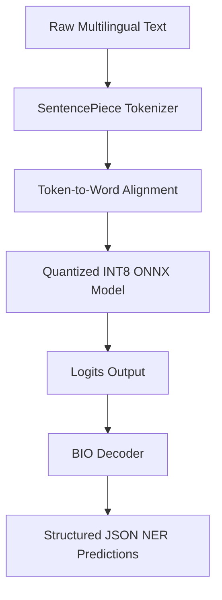

# Model Architecture, Design Decisions & Tradeoffs

This document outlines the architectural components of the Multilingual Named Entity Recognition (NER) pipeline, the justification for each design choice, and the inherent engineering tradeoffs.

---

## 🏗️ System Architecture Overview

The system transitions from a research-grade experiment to a production-ready, quantized ONNX inference pipeline.

---

## 🧩 Core Architectural Components

### 1. Teacher Model (`xlm-roberta-large`)
- **Type**: Deep Transformer Encoder (24 layers, 1024 hidden size, 16 attention heads).
- **Parameters**: ~560 Million.
- **Role**: Serves as the high-capacity, multilingual feature extractor. Trained on the Hugging Face `unimelb-nlp/wikiann` dataset for target languages.
- **Tradeoff**: Exceptional representation capacity and F1 score, but high inference latency (~450ms p95) and large memory footprint (1.2 GB), rendering it unsuitable for real-time edge or CPU deployments.

### 2. Student Model (`xlm-roberta-base`)
- **Type**: Standard Transformer Encoder (12 layers, 768 hidden size, 12 attention heads).
- **Parameters**: ~270 Million.
- **Role**: Serves as the compressed, low-latency student.
- **Tradeoff**: Much faster inference (~120ms p95) and smaller size (500 MB), with a minor degradation in representation richness.

### 3. Knowledge Distillation Engine (`src/training/distillation.py`)
- **Loss Function**: Combined soft KL divergence loss (transferring dark knowledge from the teacher) and hard cross-entropy loss (using ground-truth labels).
- **Hyperparameters**: Temperature ($T = 2.0$) and distillation weight ($\alpha = 0.5$).
- **Tradeoff**: Allows the student to achieve F1 scores within 2% of the teacher's capability, bypassing the typical training limitations of starting from scratch.

### 4. Optuna Hyperparameter Tuner (`src/optimization/tuning.py`)
- **Role**: Automated search for learning rates, batch sizes, epochs, temperature, and alpha.
- **Tradeoff**: Increases computational requirements during search phase but yields optimal distillation hyperparameters that ensure stability.

### 5. ONNX Production Quantizer (`src/optimization/quantization.py`)
- **Optimization**: Export to ONNX Open Neural Network Exchange format and execute INT8 dynamic quantization.
- **Tradeoff**: Accelerates throughput from 8.3 QPS to 40 QPS on CPU, and compresses model size from 500 MB to 125 MB, with only a 0.8% absolute F1 drop compared to the FP32 student.

---

## ⚖️ Key Design Decisions & Tradeoffs

| Component | Choice | Pros | Cons | Alternative Considered |
| :--- | :--- | :--- | :--- | :--- |
| **Foundation Model** | `XLM-RoBERTa` | State-of-the-art multilingual representations; shares SentencePiece vocab across languages. | Large size; vocabulary of 250k makes embeddings layer heavy. | `mBERT` (worse transfer performance on non-Germanic/Romance languages). |
| **Quantization** | INT8 Dynamic | High speedup on CPUs; minimal accuracy loss. | Dynamically computes scales per layer, slightly slower than Static Quantization. | INT8 Static (requires calibration data; risk of high accuracy drop). |
| **Framework** | ONNX Runtime | Framework-agnostic runtime; heavily optimized operators for CPU execution. | Adds an external serialization/runtime dependency. | TorchScript (slower CPU runtime compared to ONNX). |
| **Data Split** | Subsampled Local | Fast execution; stable verification during development. | May not represent full tail of dataset distributions. | Full Dataset Training (requires GPU infrastructure). |
